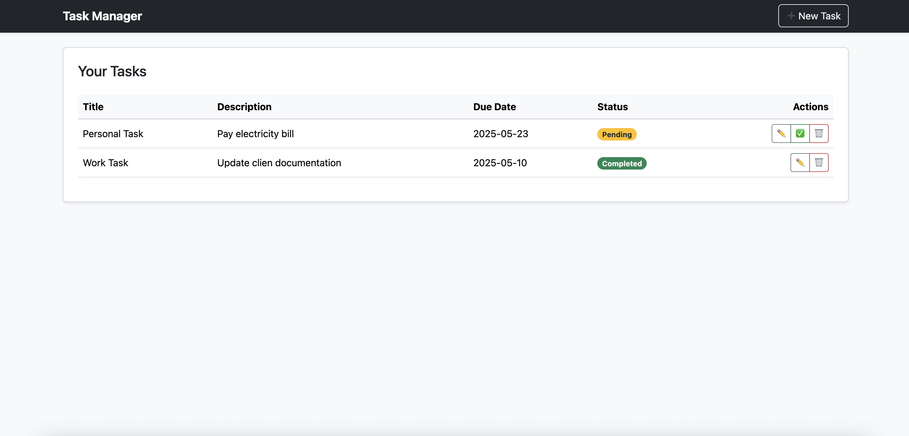

# Task Manager


Jednoduchá webová aplikácia na správu úloh vytvorená pomocou **Spring Boot**, **Thymeleaf** a **Bootstrap 5**.  
A simple web application for managing tasks built with **Spring Boot**, **Thymeleaf**, and **Bootstrap 5**.



## Funkcie / Features

- Vytvorenie novej úlohy / Create a new task
- Zobrazenie zoznamu úloh / View task list
- Úprava existujúcich úloh / Edit existing tasks
- Označenie úloh ako dokončené / Mark tasks as completed
- Zmazanie úloh / Delete tasks
- Moderné a responzívne používateľské rozhranie / Modern and responsive UI

## Použité technológie / Technologies used

- Java 17
- Spring Boot 3
- Spring Data JPA
- Thymeleaf
- Bootstrap 5
- Maven

## Spustenie projektu / Run the project

```bash
./mvnw spring-boot:run
```
Aplikácia sa spustí na: http://localhost:8080
The app will be running at: http://localhost:8080

## Štruktúra projektu / Project structure
```plaintext

com.example
├── controller         // webové rozhranie / web controller
├── model              // entita Task / Task entity
├── repository         // prístup k databáze / database access
├── resources
│   └── templates      // HTML šablóny / Thymeleaf templates
└── TaskManagerApplication.java
```

## Licencia / License

Tento projekt je určený ako ukážkový – môžeš ho voľne použiť alebo upraviť.  
This is a sample project – feel free to use or modify it.
